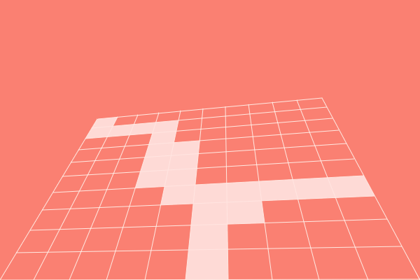

# perspective-grid

[](http://github.com/badges/stability-badges)

Two point perspective grid on canvas



## Usage

[](https://www.npmjs.com/package/perspective-grid)

```javascript
let ctx = canvas.getContext('2d');

let grid = new PerspectiveGrid(ctx, 10, squares);
grid.init(
  new Point(140, 170),
  new Point(canvas.width - 140, 140),
  new Point(canvas.width, canvas.height),
  new Point(0, canvas.height)
);
grid.update();
// grid.debug = true;
```

```javascript
// Draw
ctx.save();
// Operations on lines...
// ctx.lineWidth = 1;
grid.drawLines();
ctx.restore();

ctx.save();
grid.drawSquares();
ctx.restore();
```

or

```javascript
// Draw
ctx.save();
grid.draw();
ctx.restore();
```

## Test

```bash
npm test
```

## Caveat

Does not work correctly when there is only one vanishing point

## License

MIT, see [LICENSE.md](http://github.com/dmnsgn/perspective-grid/blob/master/LICENSE.md) for details.
